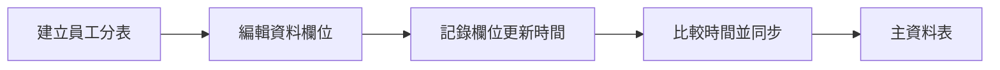

# 試算表專案追蹤同步

**技術：** Google Sheets、Google Apps Script（JavaScript）。

```mermaid
flowchart LR
    Setup[建立員工分表] --> Edit[編輯資料欄位]
    Edit --> Trigger[記錄欄位更新時間]
    Trigger --> Sync[比較時間並同步]
    Sync --> Master[主資料表]
```

English: A Google Sheets and Apps Script workflow for field-level change tracking and synchronization.
