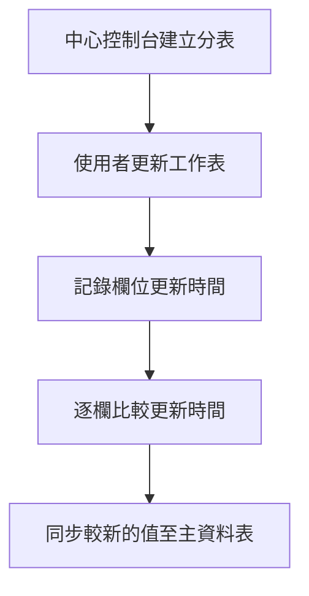

# 試算表專案追蹤同步

獨立設計與開發專案追蹤工具，以主表作為中心控制台，管理分表並彙整各使用者更新的資料。

## 同步流程

```mermaid
flowchart TB
    A[中心控制台建立分表] --> B[使用者更新工作表]
    B --> C[記錄欄位更新時間]
    C --> D[逐欄比較更新時間]
    D --> E[同步較新的值至主資料表]
```

以欄位為單位比較更新時間：例如 A 更新進度、B 更新負責人時，可分別保留最新值；同一欄位衝突時則採用記錄時間較新的值。

**技術：**Google Sheets、Google Apps Script、安裝型 onEdit 觸發器。
